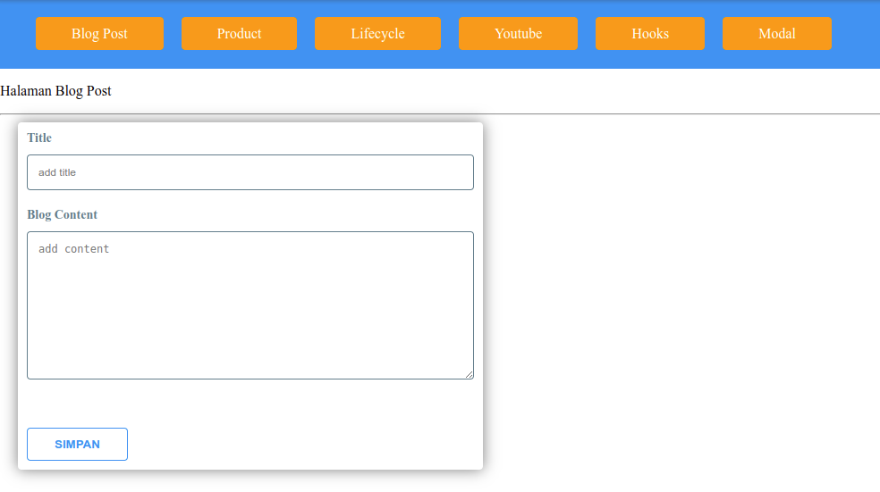

# Learnng with Create React App

This playground was bootstrapped with [Create React App](https://github.com/facebook/create-react-app).

### Learn with

Here are a list of learning resources i used:

* [Prawito Hudoro](https://www.youtube.com/playlist?list=PLU4DS8KR-LJ03qEsHn9zV4qdhcWtusBqb)
* [Sastra Nababan](https://www.youtube.com/playlist?list=PLwvMCa_o2LavzOWwLZwlcGgCzW6qkCf4O)
* [Progate Plus](https://progate.com/lessons/react/study/4)

## Get the source and try

In the project directory, simply run:

### `npm install` then  `npm start`

Runs the app in the development mode.\
Open [http://localhost:3000](http://localhost:3000) to view it in the browser.

